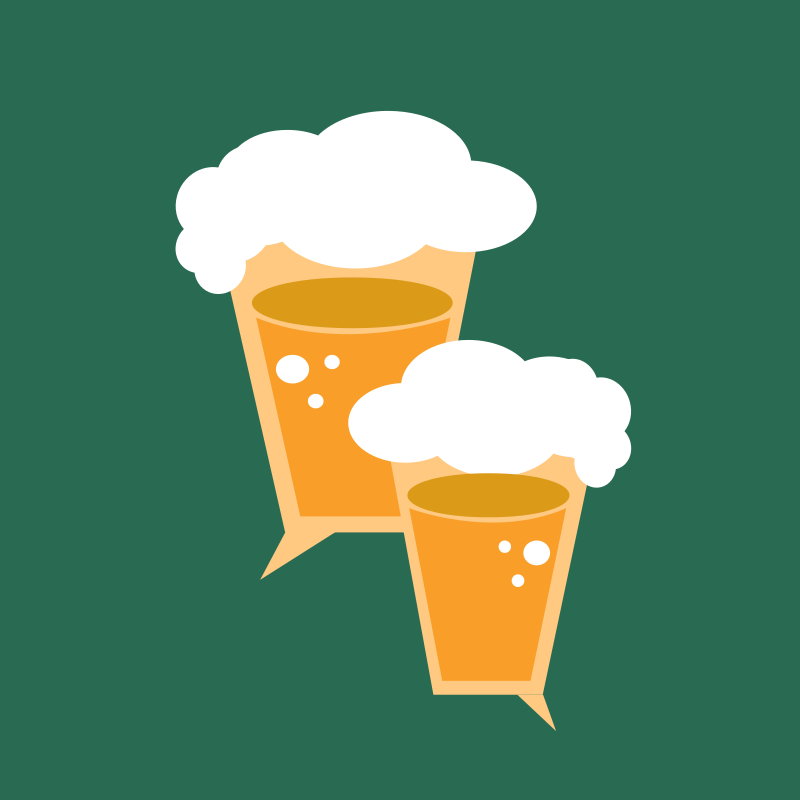

  
  
# Connect Out - Social Activity Platform

Connect Out is a social activity platform that enables users to join and discover new activities based on their interests. It fosters social interaction and community engagement, making it easier to meet like-minded people and discover new hobbies. Our app features a rating system that discourages bad behaviors while rewarding good ones, ensuring a positive and engaging experience for users.

# Project Background

Connect Out was developed by a team of top engineers during our 3rd year of Bachelor in Computer Science at EPFL. The main goal of this project was not only to create a cutting-edge application but also to gain practical experience in working collaboratively as a team in a professional setting.

We adopted the Agile Scrum methodology to ensure efficient project management and maximize productivity. The project spanned over 7 sprints, each lasting 2 weeks. During each sprint, we focused on specific goals and deliverables, allowing us to iterate and refine our application in an iterative and incremental manner.

To facilitate smooth project execution, we assigned a different team member as the Scrum Master for each sprint. This approach provided us with valuable hands-on experience in leadership, coordination, and ensuring the successful delivery of the project within the set timeline.

Throughout the development process, we embraced best practices in software engineering, including code reviews, continuous integration, and automated testing. This enabled us to maintain high code quality and ensure the stability and reliability of our application.

By working together as a cohesive team, we tackled complex challenges, made critical design decisions, and successfully implemented a real-world application. This project has not only enhanced our technical skills but also instilled in us the ability to collaborate effectively, communicate efficiently, and deliver high-quality software products.

We are proud to present Connect Out as a testament to our expertise, professionalism, and dedication to creating innovative solutions that foster social interaction and community engagement.

# Prerequisites

Before running this project, please ensure you have the following:

- Android 13 installed on your development machine.
- Android API Level 32 installed and configured in your development environment.

# Getting Started

To set up and run this project, follow these steps:

1. Download and install Android Studio from [here](https://developer.android.com/studio).
2. Clone this repository to your local machine.
3. Open the project in Android Studio.
4. Make sure you have the Android 13 SDK installed. If not, open the SDK Manager in Android Studio and install it.
5. Set the targetSdkVersion to 32 in the `build.gradle` file of your project.
6. Build and run the application on an emulator or a connected device.

If you encounter any issues related to Android 13 or API Level 32, please refer to the official Android documentation or the Android developer community for assistance.

# Demo

Check out the demo of our app on YouTube: [Demo Video](https://youtu.be/Oil0FFvZltE)

